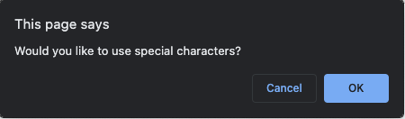

# JavaScript Password Generator

### Capable of generating a PW between 8-128 characters. PW length is determined by user via window prompt.

### If user selects a character length < 8 OR > 128, "Please select a valid character length" alert is shown. 

### User is brought through a series of prompts asking whether their password must contain uppercase, lowercase, special characters, and/or numbers.

### If user selects NONE of the character types prompted--error message will show as alert:

### If user selects AT LEAST 8 charcters (AND no more than 128), and AT LEAST ONE character type, random password will be generated and displayed.

***Password is GUARANTEED to contain AT LEAST one character of each type user selects.

Link to deployed app: https://mloercher.github.io/password-generator/